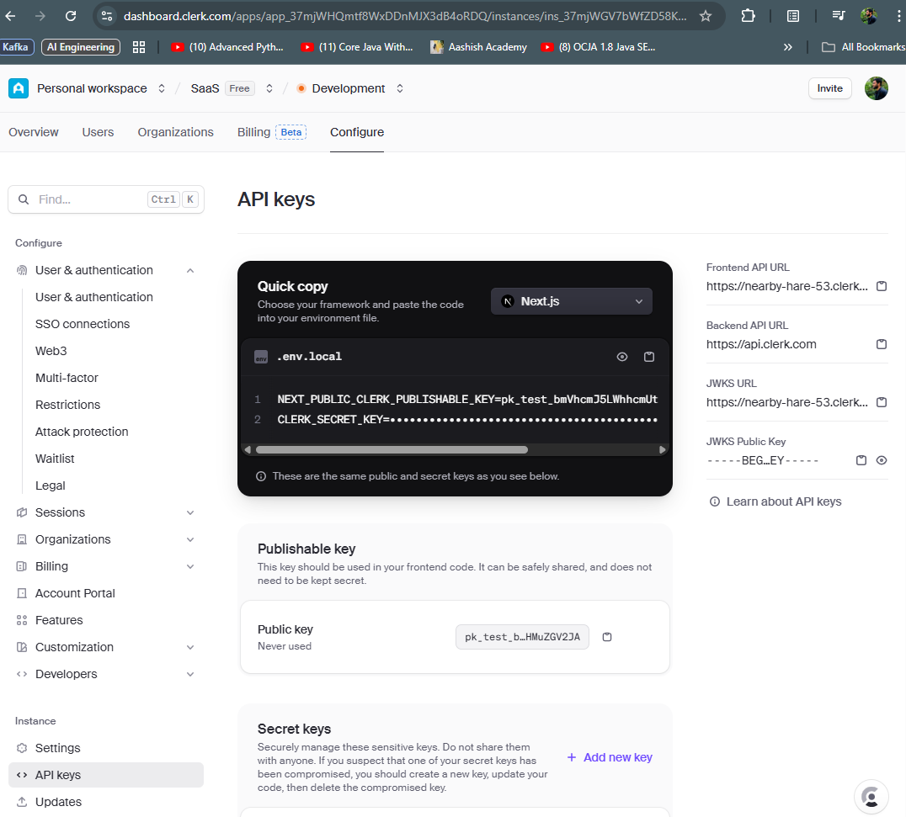
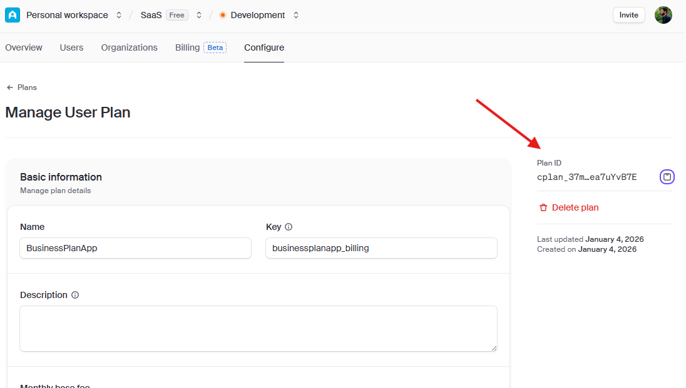

## Steps to delpoy APP to Vercel

1. Make sure to intall vercel on your system
- > npm install -g vercel 

2. No need of vercel.json file for deployment, just create vercel link and vercel will auto identify everything by the project structure we followed, just the bellow CMD
- > vercel link

3. Add the EVN Variable
- > vercel env add GROQ_API_KEY

4. Deploy the APP
- > vercel .

5. To Deploy th PROD
- > vercel --prod

## Steps to setup Clerk Account for User Authentication

1. Create Your Clerk Account
    - > Visit [clerk.com](https://clerk.com/) and click Sign Up
    - >Create your account using Google auth (or your preferred method)
    - > You'll be taken to Create Application (or click "Create Application" if returning)
2. Install Clerk Dependencies
    - > In your terminal, install the Clerk SDK: npm install @clerk/nextjs
    - > For handling streaming with authentication, also install: npm install @microsoft/fetch-event-source
3. Configure Environment Variables: 
    - > Create a .env.local file in your project root:
    > NEXT_PUBLIC_CLERK_PUBLISHABLE_KEY=your_publishable_key_here
    > CLERK_SECRET_KEY=your_secret_key_here
    > Important: Copy these values from the Clerk dashboard (they're displayed after creating your application on the configure screen).
    - > 
4. Configure Backend Authentication
    - > Add to .env.local: CLERK_JWKS_URL=your_jwks_url_here
5. Add Environment Variables to Vercel
    - > Add your Clerk keys to Vercel:
        > vercel env add NEXT_PUBLIC_CLERK_PUBLISHABLE_KEY
    - > Paste your publishable key and select all environments.
        > vercel env add CLERK_SECRET_KEY
    - > Paste your secret key and select all environments.
        > vercel env add CLERK_JWKS_URL
6. Test Locally
    - > Test your authentication locally:
        > run this CMD on project root terminal: vercel dev
        > Note: The Python backend won't work locally with vercel dev, but the authentication flow will work perfectly! You'll be able to sign in, sign out, and see the user interface. Visit http://localhost:3000 and:

7. Deploy to Production
    - > run this CMD on project root terminal: vercel --prod


## Enable Billing using Clerk

1. Go to your [Clerk Dashboard ](https://dashboard.clerk.com/)
2. Select your SaaS application
3. Click Configure in the top navigation
4. Click Subscription Plans in the left sidebar
5. Click Get Started if this is your first time
6. Copy Plan ID from clerk
    - > 


This is a [Next.js](https://nextjs.org) project bootstrapped with [`create-next-app`](https://nextjs.org/docs/pages/api-reference/create-next-app).

## Getting Started

First, run the development server:

```bash
npm run dev
# or
yarn dev
# or
pnpm dev
# or
bun dev
```

Open [http://localhost:3000](http://localhost:3000) with your browser to see the result.

You can start editing the page by modifying `pages/index.tsx`. The page auto-updates as you edit the file.

[API routes](https://nextjs.org/docs/pages/building-your-application/routing/api-routes) can be accessed on [http://localhost:3000/api/hello](http://localhost:3000/api/hello). This endpoint can be edited in `pages/api/hello.ts`.

The `pages/api` directory is mapped to `/api/*`. Files in this directory are treated as [API routes](https://nextjs.org/docs/pages/building-your-application/routing/api-routes) instead of React pages.

This project uses [`next/font`](https://nextjs.org/docs/pages/building-your-application/optimizing/fonts) to automatically optimize and load [Geist](https://vercel.com/font), a new font family for Vercel.

## Learn More

To learn more about Next.js, take a look at the following resources:

- [Next.js Documentation](https://nextjs.org/docs) - learn about Next.js features and API.
- [Learn Next.js](https://nextjs.org/learn-pages-router) - an interactive Next.js tutorial.

You can check out [the Next.js GitHub repository](https://github.com/vercel/next.js) - your feedback and contributions are welcome!

## Deploy on Vercel

The easiest way to deploy your Next.js app is to use the [Vercel Platform](https://vercel.com/new?utm_medium=default-template&filter=next.js&utm_source=create-next-app&utm_campaign=create-next-app-readme) from the creators of Next.js.

Check out our [Next.js deployment documentation](https://nextjs.org/docs/pages/building-your-application/deploying) for more details.
